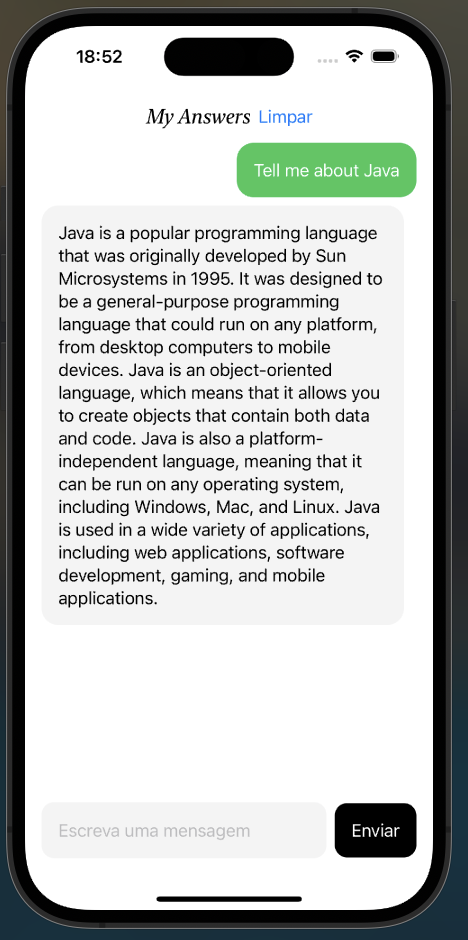

# ChatMyAnswers

On this project, a interface was created using Swift that looks like a chat. On this chat, we can talk with OpenAI API, that returns an answer like Chat GPT. I used some libs such as Alamofire for requests. 

